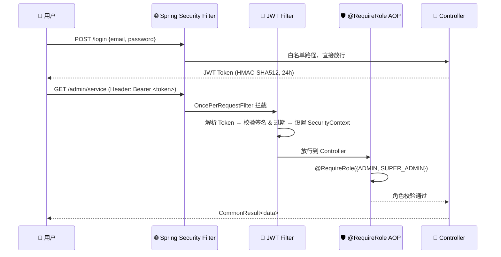

<p align="center">
  
</p>

<p align="center">
  
  
  
  
  
  
  
  
</p>

<p align="center">
  
  
  
  
</p>

<br />

---

## 📖 项目简介

**校园预约管理系统**（Campus Appointment System）是一个面向高校的综合预约管理平台，采用前后端分离架构，支持**自习室预约、心理咨询、学业辅导、考试报名、社团活动**等多种校园服务场景。系统实现了从用户注册登录、服务浏览预约、管理员审核到邮件通知的完整业务流程。

> 🎯 **设计目标**：以领域驱动设计（DDD）为指导，构建高内聚低耦合的企业级 Java 后端，既可部署运行，也可作为 Spring Boot 多模块架构的教学参考项目。

<br />

---

## ✨ 功能亮点

<table>
<tr>
<td width="50%">

### 👤 用户端
- 🔐 **邮箱验证码注册** — SMTP 发送 6 位验证码，Redis 限频防刷（60s 间隔）
- 🧮 **算术验证码** — Hutool 生成数学题 CAPTCHA，防止机器注册
- 📋 **多类型预约** — 教室 / 设备 / 咨询 / 活动，动态服务目录
- 📊 **预约状态追踪** — 实时查看审核进度：提交 → 通过 / 拒绝 / 取消
- 📧 **审核结果邮件通知** — 通过或拒绝均自动发送邮件
- 🌤️ **校园天气** — 集成第三方天气 API，辅助用户决策

</td>
<td width="50%">

### 🛡️ 管理端
- 📝 **服务管理** — 动态上下架服务项，即时生效
- ✅ **预约审核** — 逐条审批，填写通过/拒绝原因
- 🔒 **三级 RBAC** — 普通用户 / 管理员 / 超级管理员
- 📁 **文件上传** — 支持本地存储 & 阿里云 OSS 双模式
- 📱 **短信通知** — 集成阿里云 SMS（预留接口）
- 🤖 **AI 对话** — 接入 Qwen 大模型，智能问答（可选）

</td>
</tr>
</table>

<br />

---

## 🧱 系统架构

```
                        +--------------------------+
                        |       Frontend SPA       |
                        |  Vue3 + TS + ElementPlus |
                        |        Port :3000        |
                        +------------+-------------+
                                     |
                      HTTP REST · JWT Bearer Token
                                     |
                        +------------+-------------+
                        |    Backend (Port :18080) |
                        +------------+-------------+
                                     |
                    +----------------+----------------+
                    |                                  |
          +--------+----------+              +--------+--------+
          |   cas-server      |              |  Health · CORS  |
          | SpringBoot Entry  |              |  Actuator       |
          +--------+----------+              +-----------------+
                   |
          +--------+----------------------------------+
          |          Business Modules                 |
          +--------+----------------------------------+
                   |
          +--------+----------+
          | cas-module-       |
          |   appointment     |  --> booking, audit, email notify
          +--------+----------+
                   |  depends on
          +--------+----------+
          | cas-module-system |  --> user, auth, role, captcha
          +--------+----------+
                   |  depends on
       +-----------+-----------+
       |           |           |
  +----+----+ +----+----+ +---+------+
  |  infra  | | third-  | |  common  |
  |  file   | |  party  | |  shared  |
  |  email  | | AI/OSS  | |  kernel  |
  |  qrcode | | SMS/Wth | |  utils   |
  +----+----+ +----+----+ +---+------+
       |           |           |
       +-----------+-----------+
                   |
          +--------+----------+
          |  cas-framework    |
          |  6 Spring Boot    |
          |     Starters      |  --> Web · Security · MyBatis · Redis · MQ · Test
          +--------+----------+
                   |
          +--------+----------+
          |  Infrastructure   |
          |  MySQL · Redis    |
          |  SMTP · Aliyun    |
          |  Qwen API         |
          +-------------------+
```

<br />

---

## 🧩 模块说明

| 模块 | 层级 | 说明 | 核心功能 |
|------|------|------|----------|
| **cas-dependencies** | BOM | 统一依赖管理 | 所有第三方库版本号集中管控 |
| **cas-framework** | 基础设施 | 6 个 Spring Boot Starter | Web · Security · MyBatis · Redis · MQ · Test |
| **cas-common** | 共享内核 | 24 个共享类 | 异常体系 · JWT 工具 · 枚举 · 通用响应 · BCrypt |
| **cas-module-infra** | 基础设施服务 | 文件 / 邮件 / 二维码 | 本地 & OSS 上传 · @Async 邮件 · Hutool QR |
| **cas-module-system** | 业务模块 | 用户 & 权限管理 | 注册登录 · 角色管理 · @RequireRole AOP 鉴权 |
| **cas-module-appointment** | 业务模块 | 预约核心业务 | 多类型预约 · 审核流程 · 邮件通知 · 事务管理 |
| **cas-thirdparty** | 第三方集成 | 外部 API 封装 | 阿里云 OSS/SMS · Qwen AI · 天气查询 |
| **cas-server** | 入口 | 启动 & 配置 | Spring Boot 入口 · application.yml · CORS |

<br />

---

## 🏛️ DDD 四层架构

每个业务模块内部遵循统一的领域驱动设计分层：

```
📁 cas-module-appointment/
├── interfaces/       ← 接口层 ── REST Controllers + DTOs
│   ├── controller/      • admin/ — 管理端接口 (@RequireRole 保护)
│   │                    • app/   — 用户端接口
│   ├── dto/             • request/  — 入参 DTO
│   │                    • response/ — 出参 DTO
│   └── assembler/       • Entity ↔ DTO 转换器
│
├── application/      ← 应用层 ── 业务编排
│   └── service/         • 协调领域对象，组合业务流程
│                        • 调用 repository、发送事件
│
├── domain/           ← 领域层 ── 纯 POJO，零框架注解
│   ├── entity/          • 核心业务实体
│   └── repository/      • 仓储接口（契约）
│
├── infrastructure/   ← 基础设施层 ── 技术实现
│   └── persistence/     • MyBatis Mapper · DO · Repository Impl
│
└── api/              ← 跨模块 API ── 模块间契约
    └── XxxApi.java      • 仅供其他模块注入调用
```

> 💡 **核心约束**：`domain/` 层**零框架注解**，保持纯 Java；模块间只能通过 `api/` 接口通信，**禁止直接注入对方 Mapper**。

<br />

---

## 🔐 安全设计



| 安全机制 | 实现方式 |
|----------|----------|
| **认证** | 无状态 JWT（HMAC-SHA512），24h 过期 |
| **授权** | `@RequireRole({ADMIN, SUPER_ADMIN})` 注解 + AOP 切面 |
| **密码** | BCrypt 加密存储 |
| **防刷** | Redis 记录验证码发送频率，60s 间隔限制 |
| **验证码** | 算术 CAPTCHA + 邮箱验证码，Redis 5min TTL |
| **Session** | `STATELESS` 策略，CSRF 已禁用 |

<br />

---

## 🗄️ 数据库设计

```sql
-- 核心 ER 关系
user (id, name, email, password, role)          ← 用户表，role: 0/1/2
  │
  ├──< item (order_id, user_id, service_id,     ← 预约记录表
  │          manage_status, reason)                status: 提交→通过→拒绝→取消
  │
services (service_id, service_name,              ← 服务目录表
           service_describe, service_state)         state: 0 下架 / 1 上架

file_info (file_name, file_uuid,                 ← 文件信息表
           upload_user, is_deleted)                 is_deleted 逻辑删除

ai_chat_history (user_id, model,                 ← AI 对话历史
                  user_message, ai_response)
```

<br />

---

## 🚀 快速开始

### 环境要求

| 依赖 | 版本 | 说明 |
|------|------|------|
| ☕ JDK | 17+ | 必须 17 以上（Spring Boot 3.3 要求） |
| 🗄️ MySQL | 8.0+ | 创建数据库 `cas_db`，字符集 `utf8mb4` |
| 💾 Redis | 7.0+ | 标准端口 6379 |
| 📧 SMTP | — | 163 邮箱或兼容服务（可选，注册需要） |
| 🔧 Maven | 3.6+ | 或使用 IDE 内置 |

### ① 初始化数据库

```bash
# 1. 创建数据库
mysql -u root -p -e "CREATE DATABASE IF NOT EXISTS cas_db DEFAULT CHARSET utf8mb4 COLLATE utf8mb4_unicode_ci;"

# 2. 导入表结构 + 示例数据
mysql -u root -p cas_db < sql/database.sql
mysql -u root -p cas_db < sql/user.sql
mysql -u root -p cas_db < sql/services.sql
mysql -u root -p cas_db < sql/item.sql
mysql -u root -p cas_db < sql/file.sql
mysql -u root -p cas_db < sql/ai_chat_history.sql
mysql -u root -p cas_db < sql/data.sql
mysql -u root -p cas_db < sql/indexes.sql
```

### ② 配置环境

```bash
# 复制配置模板
cp cas-server/src/main/resources/application.yml.example \
   cas-server/src/main/resources/application.yml

# 编辑 application.yml，填写你自己的：
#   - spring.datasource.password        ← MySQL 密码
#   - spring.mail.username / password   ← 邮箱账号
#   - jwt.secret                        ← JWT 密钥（至少 64 字符）
#   - aliyun.*                          ← 阿里云 OSS / SMS 凭证（可选）
```

### ③ 启动后端

```bash
# 编译打包
mvn clean package -DskipTests

# 启动服务（端口 18080）
java -jar cas-server/target/cas-server-1.0.0.jar
```

### ④ 启动前端（可选）

```bash
cd ../frontend
npm install
npm run dev
# 浏览器打开 → http://localhost:3000
```

### ⑤ 访问验证

| 地址 | 说明 |
|------|------|
| 🌐 `http://localhost:18080` | 后端服务 |
| 📖 `http://localhost:18080/doc.html` | Knife4j API 文档 |
| 💚 `http://localhost:18080/actuator/health` | 健康检查 |
| 🖥️ `http://localhost:3000` | 前端页面（需启动前端） |

### ⑥ 测试账号

| 角色 | 邮箱 | 说明 |
|------|------|------|
| 👑 超级管理员 | 由数据库直接注册 | role=2，拥有最高权限 |
| 🛡️ 管理员 | 由数据库直接注册 | role=1，可审核预约 |
| 👤 普通用户 | 通过注册接口注册 | role=0，注册后可得 |

<br />

---

## 🔌 API 接口一览

> 完整文档在启动后访问 `http://localhost:18080/doc.html` 查看交互式 Swagger。

<details>
<summary><b>📋 点击展开 API 接口列表</b></summary>

### 认证模块
| Method | Path | Auth | 说明 |
|--------|------|------|------|
| POST | `/login` | ❌ | 邮箱 + 密码登录 |
| POST | `/email` | ❌ | 发送邮箱验证码 |
| POST | `/register/verify-code` | ❌ | 验证码注册 |
| GET | `/graphic/get` | ❌ | 获取算术验证码 |

### 用户端
| Method | Path | Auth | 说明 |
|--------|------|------|------|
| GET | `/service` | ✅ | 获取所有可用服务 |
| POST | `/book` | ✅ | 预约服务 |
| POST | `/book/room` | ✅ | 预约教室 |
| POST | `/book/equipment` | ✅ | 预约设备 |
| POST | `/book/consultation` | ✅ | 预约咨询 |
| GET | `/service-status/user` | ✅ | 查看预约记录 |
| GET | `/weather` | ✅ | 查询天气 |

### 管理端
| Method | Path | Auth | 说明 |
|--------|------|------|------|
| GET | `/admin/service` | 🔒 ADMIN+ | 管理服务列表 |
| POST | `/admin/service` | 🔒 ADMIN+ | 新增服务 |
| POST | `/admin/service-status/audit/pass` | 🔒 ADMIN+ | 通过预约 |
| POST | `/admin/service-status/audit/reject` | 🔒 ADMIN+ | 拒绝预约 |
| POST | `/admin/file/upload` | 🔒 ADMIN+ | 上传文件 |
| GET | `/admin/users` | 🔒 SUPER_ADMIN | 用户管理 |

</details>

<br />

---

## 🛠️ 技术栈

<table>
<tr>
<th>分类</th>
<th>技术</th>
<th>版本</th>
<th>用途</th>
</tr>
<tr>
<td rowspan="4">核心框架</td>
<td></td>
<td>3.3.5</td>
<td>应用框架 + 自动配置</td>
</tr>
<tr>
<td></td>
<td>17</td>
<td>运行环境</td>
</tr>
<tr>
<td></td>
<td>3.9</td>
<td>多模块项目构建</td>
</tr>
<tr>
<td>Spring Security</td>
<td>6.3</td>
<td>安全框架 + Filter 链</td>
</tr>
<tr>
<td rowspan="3">数据访问</td>
<td>MyBatis-Plus</td>
<td>3.5.5</td>
<td>ORM + 代码生成</td>
</tr>
<tr>
<td>MySQL Connector</td>
<td>8.0</td>
<td>数据库驱动</td>
</tr>
<tr>
<td>Spring Data Redis</td>
<td>3.3</td>
<td>缓存 + 验证码存储</td>
</tr>
<tr>
<td rowspan="4">工具库</td>
<td>Hutool</td>
<td>5.8.32</td>
<td>Java 工具集（验证码 / 二维码）</td>
</tr>
<tr>
<td>jjwt</td>
<td>0.12.6</td>
<td>JWT 令牌创建 & 解析</td>
</tr>
<tr>
<td>MapStruct</td>
<td>1.6.3</td>
<td>对象映射转换</td>
</tr>
<tr>
<td>Lombok</td>
<td>1.18</td>
<td>简化 POJO 代码</td>
</tr>
<tr>
<td rowspan="2">API 文档</td>
<td>Knife4j</td>
<td>4.5.0</td>
<td>Swagger 增强文档</td>
</tr>
<tr>
<td>OpenAPI 3</td>
<td>—</td>
<td>API 规范描述</td>
</tr>
<tr>
<td rowspan="3">第三方服务</td>
<td>阿里云 OSS</td>
<td>—</td>
<td>对象存储</td>
</tr>
<tr>
<td>阿里云 SMS</td>
<td>2.0.2</td>
<td>短信发送</td>
</tr>
<tr>
<td>通义千问</td>
<td>—</td>
<td>AI 对话（DashScope API）</td>
</tr>
</table>

<br />

---

## 📁 项目结构

<details open>
<summary><b>🌲 点击展开完整目录树</b></summary>

```
CampusAppointmentSystem/
│
├── cas-dependencies/              📦 BOM — 统一版本管控
│   └── pom.xml
│
├── cas-framework/                 🏗️ 框架层 — 6 个 Spring Boot Starter
│   ├── cas-common/                   🧰 共享内核 (24 files)
│   │   ├── annotation/RequireRole.java     # 角色注解
│   │   ├── enums/                          # 用户角色 · 审核状态
│   │   ├── exception/                      # 异常体系 (8 类)
│   │   ├── result/CommonResult.java        # 统一响应体
│   │   ├── security/                       # JWT · SecurityUtils
│   │   └── util/                           # BCrypt · CodeGenerator
│   ├── cas-spring-boot-starter-web/        # 🌐 全局异常处理
│   ├── cas-spring-boot-starter-security/   # 🔐 JWT Filter · CORS
│   ├── cas-spring-boot-starter-mybatis/    # 🗄️ MyBatis-Plus 配置
│   ├── cas-spring-boot-starter-redis/      # 💾 RedisTemplate · RedisUtil
│   ├── cas-spring-boot-starter-mq/         # 📨 消息队列 (预留)
│   └── cas-spring-boot-starter-test/       # 🧪 测试基类
│
├── cas-module-infra/               📧 基础设施服务
│   └── src/main/java/.../
│       ├── interfaces/controller/admin/   # 文件 / OSS 上传接口
│       ├── application/service/           # EmailService · FileService · QRCodeService
│       └── infrastructure/                # JavaMailSender · 本地存储
│
├── cas-module-system/              👥 用户 & 权限模块
│   └── src/main/java/.../
│       ├── interfaces/                     # Login / Register / Email 控制器
│       ├── application/                    # AuthService · UserService · RoleService
│       ├── domain/                         # User 实体 · UserRepository 接口
│       ├── infrastructure/                 # MyBatis Mapper · RoleAspect AOP
│       └── api/                            # UserInfoApi (供其他模块调用)
│
├── cas-module-appointment/         📅 预约核心模块
│   └── src/main/java/.../
│       ├── interfaces/                     # 7 个控制器（admin + app）
│       ├── application/                    # BookService · ServiceStatusService
│       ├── domain/                         # AppointmentRecord · Service 实体
│       ├── infrastructure/                 # 预约 / 服务 Mapper
│       └── (通过 api/ 接口向其他模块暴露能力)
│
├── cas-thirdparty/                 🌍 第三方集成
│   └── src/main/java/.../
│       ├── config/                         # AliyunConfig · DeepSeekConfig · QwenConfig
│       ├── controller/                     # AI 对话 · 天气查询
│       ├── service/                        # OSS · SMS · Weather · CallModel
│       └── domain/                         # AiChatHistory 实体
│
├── cas-server/                     🚀 启动入口
│   └── src/main/
│       ├── java/.../CampusAppointmentApplication.java
│       └── resources/
│           ├── application.yml             # 完整配置
│           └── application.yml.example     # 配置模板（安全）
│
└── sql/                            🗄️ 数据库脚本
    ├── database.sql                # 建库
    ├── user.sql / services.sql / item.sql / file.sql   # 建表
    ├── data.sql                    # 示例数据 (5 种服务)
    └── indexes.sql                 # 索引优化
```

</details>

<br />

---

## 🔄 业务流程

### 📝 预约完整生命周期

```
  [用户注册]                              [管理员]
      |                                      |
      v                                      v
  +--------+   POST /book   +--------+   audit    +----------+   邮件
  |  提交   | -------------> |  待审   | --------> | 通过/拒绝  | -------> 📧
  +--------+                +--------+            +----------+
                                 |                      |
                                 v                      v
                             也可取消              邮件内容:
                             (用户自行)            服务名称、审核结果、
                                                   原因说明、操作时间
```

### 🔐 注册流程

```
  Step 1:  POST /email {email}
           |
           +--> 生成 6 位数字验证码
           +--> Redis SET "verification_code:{email}"  TTL=300s
           +--> @Async 发送邮件到用户邮箱
           +--> Redis SET "rate_limit:email:{email}"   TTL=60s 防刷

  Step 2:  POST /register/verify-code
           { email, code, password, name, ... }
           |
           +--> Redis GET "verification_code:{email}"
           +--> 校验验证码 --> 检查邮箱唯一性
           +--> BCrypt 加密密码 --> 保存用户记录
           +--> 删除 Redis 验证码 --> 返回 JWT Token
```

<br />

---

## 🧪 单元测试

项目已为预约核心模块编写了单元测试，使用 **JUnit 5 + Mockito** 框架，遵循 Given-When-Then 模式。

### 测试概况

| 测试类 | 模块 | 测试数 | 覆盖内容 |
|--------|------|--------|----------|
| `BookServiceImplTest` | cas-module-appointment | 11 | 创建预约、空ID校验、服务不存在、服务已禁用、取消预约、查询预约 |
| `ServiceStatusServiceImplTest` | cas-module-appointment | 9 | 审核通过（有/无备注）、审核驳回（含原因校验）、订单不存在、更新失败 |
| **合计** | | **20** | 覆盖预约核心业务 & 审核流程的所有正常/异常分支 |

### 测试基础设施

- `cas-spring-boot-starter-test` — 提供 `BaseApplicationTest` 抽象基类（`@SpringBootTest`）
- `cas-module-appointment/pom.xml` — 引入 `spring-boot-starter-test`（含 JUnit 5 + Mockito）

### 运行测试

```bash
# 运行所有测试
mvn test

# 只运行 appointment 模块的测试
mvn -pl cas-module-appointment -am test

# 运行单个测试类
mvn -pl cas-module-appointment -am test -Dtest=BookServiceImplTest

# 运行单个测试方法
mvn -pl cas-module-appointment -am test -Dtest=ServiceStatusServiceImplTest#testAuditPass
```

<br />

---

## 🧪 开发计划

> ⚠️ 当前项目为功能可用的 **WIP（Work In Progress）** 状态，以下是待完善的方向：

| 优先级 | 计划 | 说明 |
|--------|------|------|
| 🟡 中 | 补充测试覆盖 | system 模块、infra 模块、Controller 层及集成测试待补全 |
| 🔴 高 | 分页查询 | 所有列表接口目前返回全量数据 |
| 🔴 高 | Bean Validation | DTO 批量添加校验注解 |
| 🟡 中 | Docker Compose 部署 | 一键启动 MySQL + Redis + 应用 |
| 🟡 中 | 幂等性设计 | 防止重复提交 |
| 🟡 中 | 前端路由守卫完善 | Token 过期自动刷新 |
| 🟢 低 | 消息队列集成 | cas-spring-boot-starter-mq 待实现 |
| 🟢 低 | CI/CD Pipeline | GitHub Actions 自动化构建 |

<br />

---

## 🤝 贡献指南

1. Fork 本项目
2. 创建特性分支：`git checkout -b feature/amazing-feature`
3. 提交修改：`git commit -m 'feat: add amazing feature'`
4. 推送分支：`git push origin feature/amazing-feature`
5. 提交 Pull Request

### 代码规范
- ✅ Controller 返回 `CommonResult<T>`
- ✅ 使用 `SecurityFrameworkUtils` 获取当前用户，**不要**注入 `HttpServletRequest`
- ✅ 使用 `@RequireRole` 注解控制权限
- ✅ 跨模块调用通过 `api/` 接口
- ✅ Domain 层保持纯 Java，**不加** Spring 注解
- ✅ 异常交给 `GlobalExceptionHandler` 统一处理

<br />

---

## 📄 许可证

本项目基于 **MIT License** 开源。

<br />

---

<p align="center">
  <sub>Built with ❤️ using Spring Boot · MyBatis-Plus · Redis · MySQL · Vue 3</sub>
  <br />
  <sub>© 2026 Campus Appointment System</sub>
</p>
